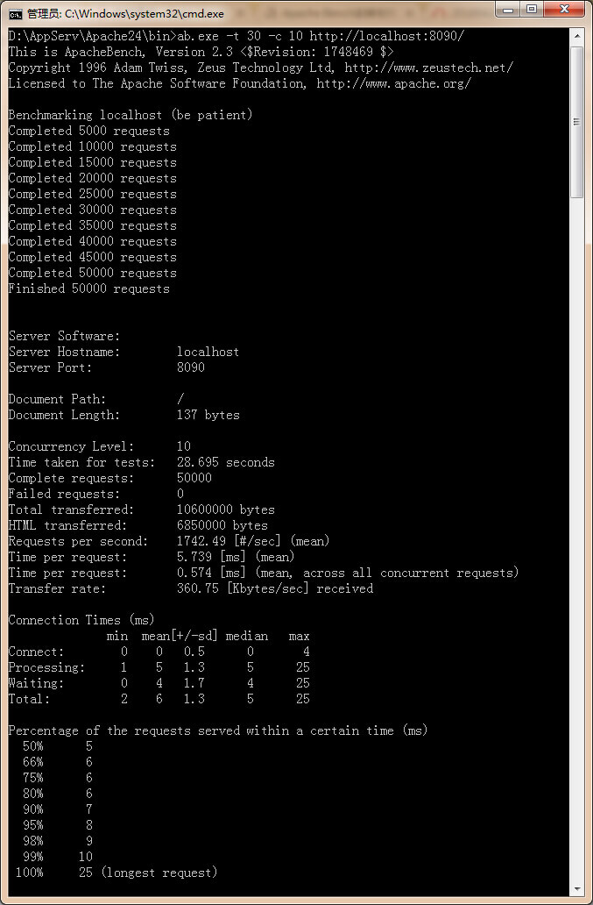

# 测试说明

这里我们使用传统的 "hello world" 做性能测试。这么做是因为我们想找到框架的最小代价，即运行应用最快得到结果的测试。

很多人认为使用 "hello world" 做测试很不准确，因为真实情况下我们的业务很复杂，比如读取数据库，
实际上这种认识有偏差，因为在 web2.0 时代后台业务大量依赖缓存，并且页面大多数数据以 ajax 方式读取，
这就导致这种架构的服务与客户端交互相当接近 "hello world" 模式。

